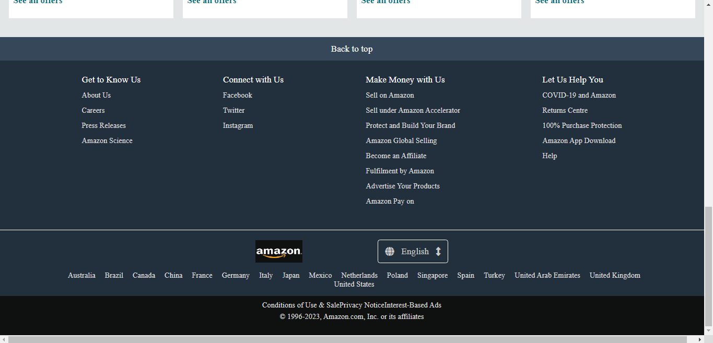

# Amazon.in-Website-Clone-

## Overview
This project is a static clone of the Amazon.in website, created as part of a personal portfolio. Technologies used are HTML and CSS.

## Demo

[Link to live demo](https://navneet-singh01.github.io/Amazon.in-Website-Clone/)

## Features
- **Static Content**: HTML and CSS-based static pages mimicking the Amazon.in layout.
- **Clean Code**: Well-structured and commented HTML and CSS for easy understanding.

## Screenshots

### 1. Navbar

### 2. Page content-1

### 3. Page content-2

### 4. Footer

## Made By
Navneet Singh (https://github.com/Navneet-Singh01)
